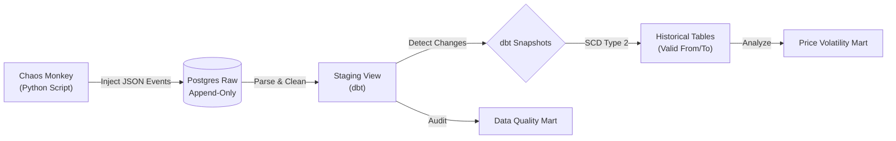

# Resilient e-commerce Data Platform (Chaos & SCD Type 2)

**Data platform designed to withstand constant data volatility. It simulates a real-world production environment featuring dirty data, duplicates, and evolving schemas, while ensuring complete historical traceability.**

---

## Project Concept
Unlike traditional "Happy Path" pipelines, this project operates on the assumption that **data failure is inevitable**. A custom "Chaos Monkey" event generator was developed to inject valid transactions interspersed with intentional inventory errors and random price fluctuations.

The primary objective is not merely data movement, but the accurate reconstruction of business history despite data noise, leveraging an **ELT (Extract, Load, Transform)** architecture.

---

## Lakehouse Architecture

**Key Components**
Resilient Ingestion:

Leverages Postgres JSONB to store raw events without a fixed structure.

If the source API changes or transmits malformed data, the pipeline does not break; it preserves the raw event for future auditing and reprocessing.

**Data Quality Management:**

Implementation of dbt tests (unique, not_null, accepted_values) to alert on data degradation.

Automated generation of an Audit Mart that calculates the Daily Error Rate.

**Slowly Changing Dimensions (SCD Type 2):**

Utilization of dbt Snapshots to track price changes over time.

Enables precise answers to historical queries, such as: "What was the price of this product 'X day' at 3:00 PM?"

**Chaos Testing Results**
The system was subjected to a stress script that generated:

Normal Events: Standard product creation and sales.

Negative Prices: Automatically detected and flagged in the Staging layer.

Price Volatility: Historically captured in the products_snapshot table.

**Tech Stack**
Ingestion: Python (Requests, Pandas, SQLAlchemy)

Storage: PostgreSQL (JSONB Features)

Transformation: dbt Core (SQL, Jinja, Snapshots)

Orchestration: Apache Airflow

Infrastructure: Docker Compose

**Execution Guide**
1. Start Services:
docker compose up --build -d

2. Initialize Raw Table:
docker compose exec postgres psql -U airflow -c "CREATE TABLE raw_events (event_id UUID PRIMARY KEY, event_type VARCHAR(50), event_timestamp TIMESTAMP, ingestion_timestamp TIMESTAMP DEFAULT CURRENT_TIMESTAMP, source VARCHAR(50), payload JSONB);"

3. Generate Chaos (Simulated Events):
docker compose exec airflow-scheduler python /opt/airflow/dags/scripts/chaos_generator.py

4. Run Full Pipeline:
docker compose exec airflow-scheduler bash -c "cd dags/ecommerce_dbt && dbt run && dbt snapshot && dbt test"

**Contact https://www.linkedin.com/in/gilberto-agramont-cloud/ Data Engineer**